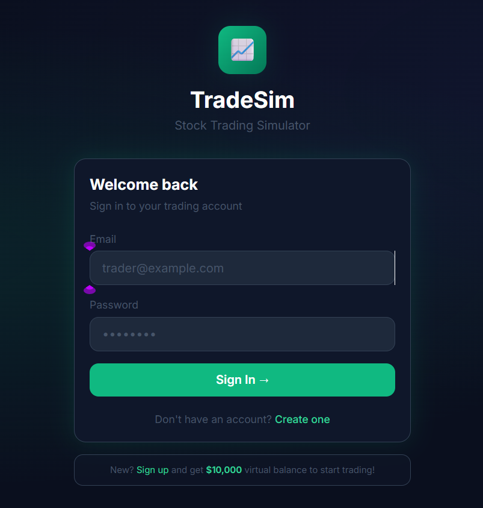

# 📈 TradeSim - Stock Trading Simulator

A full-stack stock trading simulator built using the MERN Stack that allows users to practice paper trading with virtual funds. Users can buy and sell stocks, track their portfolio, monitor market prices, and analyze investment performance through an interactive dashboard.

---

## 🚀 Live Demo

**Frontend:** Coming Soon

**Backend API:** Coming Soon

---

## 📸 Application Screenshots

### Login Page


---

### Dashboard


---

### Live Market


---

### Portfolio Analytics


---

### Wallet


---

### Holdings


---

# ✨ Features

- User Authentication (JWT)
- Secure Login & Registration
- Virtual Trading Wallet
- Buy Stocks
- Sell Stocks
- Live Market Prices
- Portfolio Management
- Profit & Loss Tracking
- Investment Analytics
- Portfolio Allocation Charts
- Holdings Table
- Responsive UI
- MongoDB Database Integration

---

# 🛠 Tech Stack

## Frontend

- React.js
- Vite
- Tailwind CSS
- React Router
- Axios
- Recharts

## Backend

- Node.js
- Express.js
- MongoDB Atlas
- Mongoose
- JWT Authentication
- bcrypt.js

---

# 📂 Project Structure

```
TradeSim
│
├── backend
│   ├── controllers
│   ├── middleware
│   ├── models
│   ├── routes
│   ├── config
│   ├── server.js
│   └── package.json
│
├── frontend
│   ├── src
│   ├── public
│   └── package.json
│
├── screenshots
├── README.md
└── .gitignore
```

---

# ⚙️ Installation

## Clone Repository

```bash
git clone https://github.com/Harini-Nagireddy/TradeSim.git
```

---

## Backend

```bash
cd backend
npm install
npm run dev
```

---

## Frontend

```bash
cd frontend
npm install
npm run dev
```

---

# 🔐 Environment Variables

Create a `.env` file inside the backend folder.

```env
MONGO_URI=YOUR_MONGODB_URI
JWT_SECRET=YOUR_SECRET_KEY
PORT=5000
```

---

# 📊 Modules

- Authentication
- Dashboard
- Market
- Portfolio
- Wallet
- Buy Stocks
- Sell Stocks
- Analytics

---

# 🎯 Future Enhancements

- Real-time Stock API Integration
- Watchlist Feature
- Portfolio Export
- Trading History Reports
- Email Notifications
- Dark/Light Theme
- Admin Dashboard

---

# 👩‍💻 Author

**Harini Nagireddy**

B.Tech - Computer Science (Data Science)

GitHub: https://github.com/Harini-Nagireddy

LinkedIn: https://www.linkedin.com/in/harini-nagireddy-95aa65356

---

## ⭐ If you like this project, consider giving it a star!